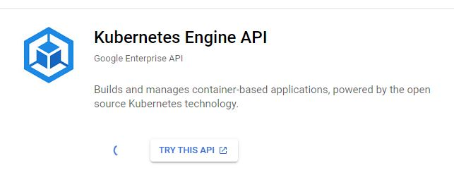
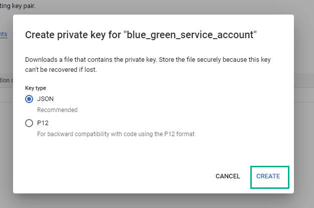
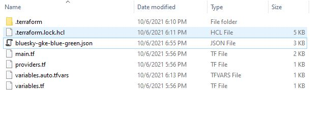
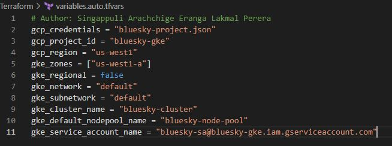

# Create a new project in GCP

`Figure: 2`

As shown in the Figure 2 create a new project in GCP

# Enable Kubernetes API Engine

`Figure: 3`

# Create a new service account under the project created in GCP

`Figure: 4`

# Create a new key for service account

`Figure: 5`

`Figure: 6`

`Figure: 7`

As shown in the Figure 7 create and download the service account key as a JSON file.

# Setup Kubernetes Cluster in GCP 

`Figure: 8`

# Add your gcp_credentials , gcp_project_id , gke_cluster_name , gke_default_nodepool_name and gke_service_account_name into variables.auto.tfvars file.

`Figure: 9`

As shown in the Figure 8 , navigate to Terraform folder and move downloaded json key file into that folder.

### Run following commands in Terminal

- `terraform init`
- `terraform plan`
- `terraform apply`

