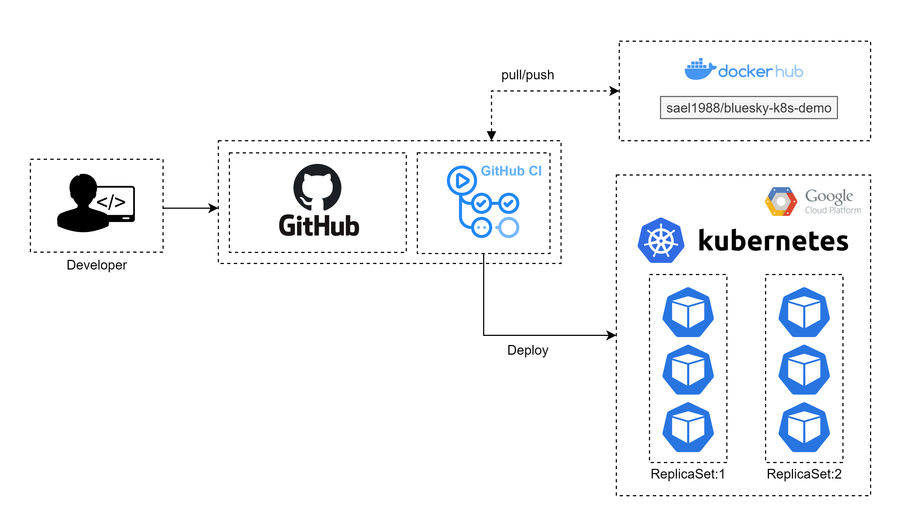
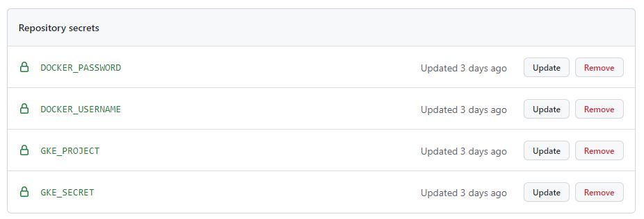

#### System Architecture

`Figure: 1`

Figure 1 shows the system Architecture of this project.

#### Please follow following steps 

#### 1. Create a new project in GCP

`Figure: 2`

As shown in the Figure 2 create a new project in GCP

#### 2. Enable Kubernetes API Engine

`Figure: 3`

#### 3. Create a new service account under the project created in GCP

`Figure: 4`

#### 4. Create a new key for service account

`Figure: 5`

`Figure: 6`

`Figure: 7`

As shown in the Figure 7 create and download the service account key as a JSON file.

#### 5. Setup Kubernetes Cluster in GCP 

`Figure: 8`

As shown in the Figure 8 , navigate to Terraform folder and move downloaded json key file into that folder.

#### 6. Add your gcp_credentials , gcp_project_id , gke_cluster_name , gke_default_nodepool_name and gke_service_account_name into variables.auto.tfvars file.

`Figure: 9`

#### 7. Run following commands in Terminal

- `terraform init`
- `terraform plan`
- `terraform apply`

#### 8. Add following secrets to github secrets

`Figure: 10`

- `DOCKER_USERNAME` - Dockerhub username
- `DOCKER_PASSWORD` - Dockerhub password
- `GKE_PROJECT` - project id (Project created in GCP)
- `GKE_SECRET`  - Holds GCP service account json file content