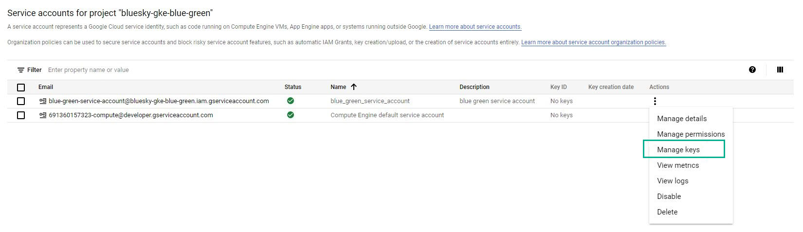

# Create a new project in GCP

`Figure: 2`

As shown in the Figure 2 create a new project in GCP

# Enable Kubernetes API Engine

`Figure: 3`

# Create a new service account under the project created in GCP

`Figure: 4`

# Create a new key for service account

`Figure: 5`

`Figure: 6`
